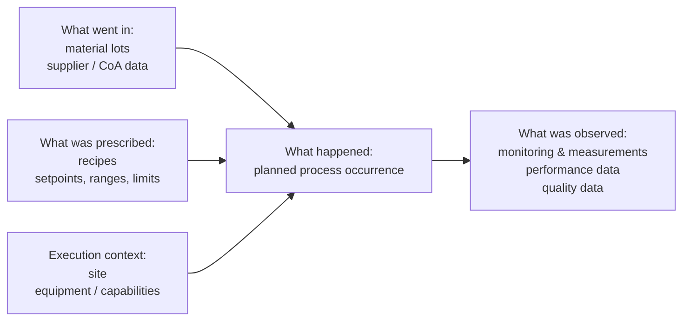
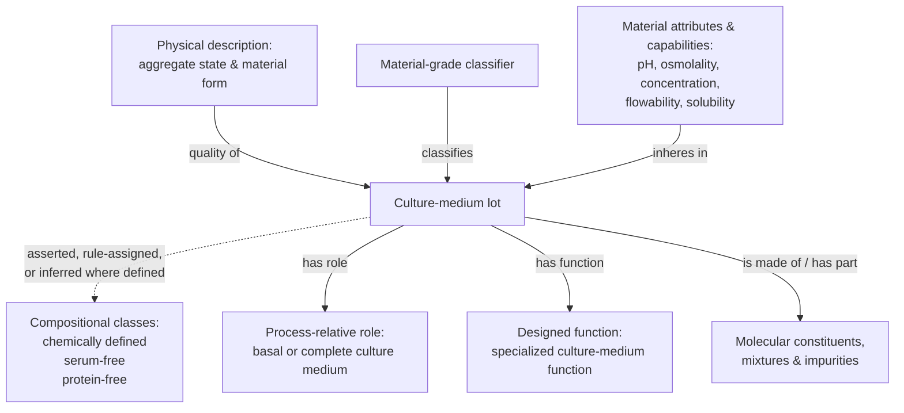
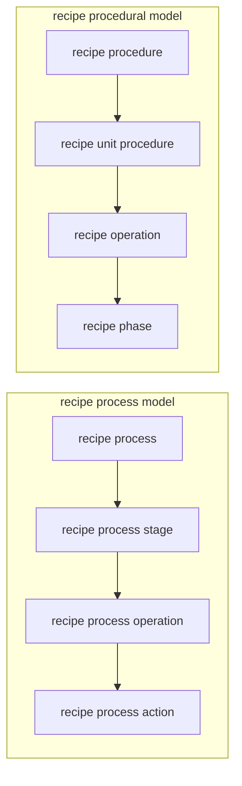
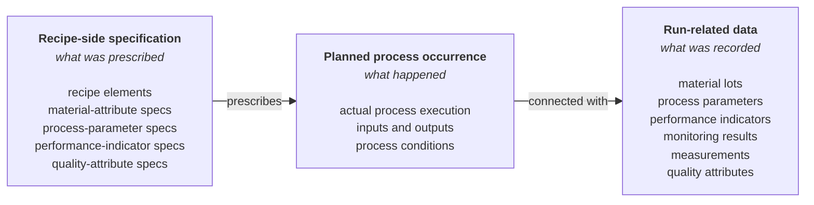
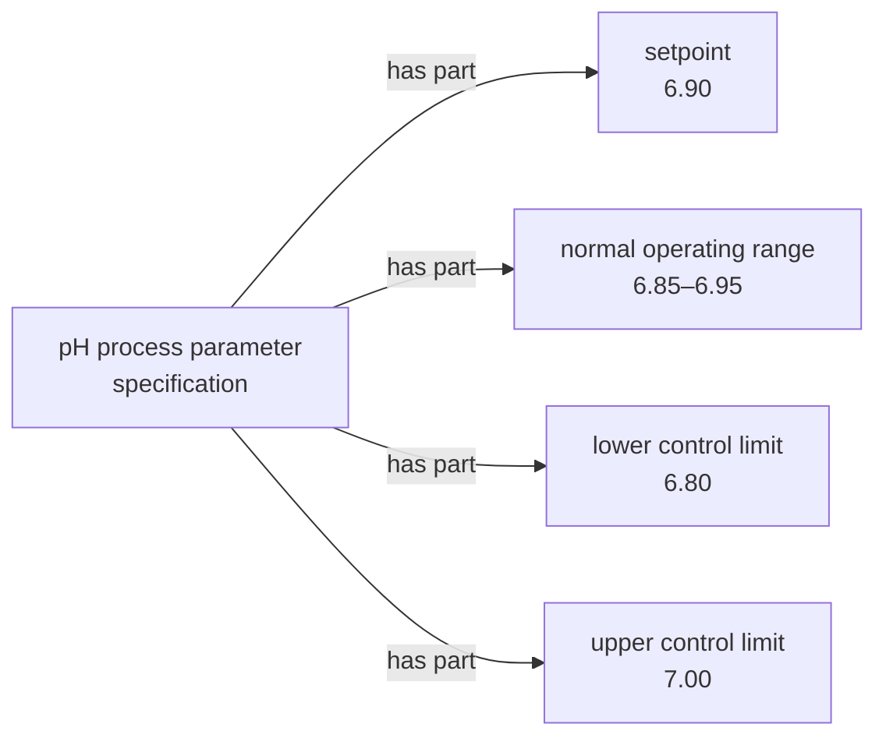
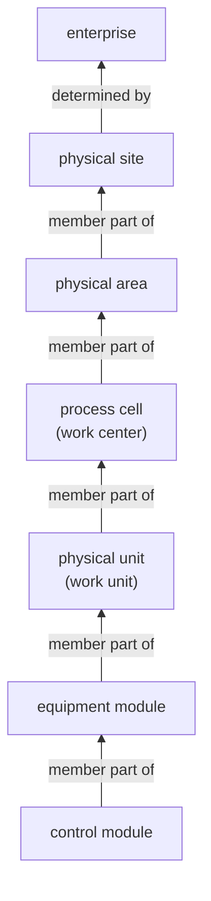

# IOF Biopharmaceutical Manufacturing Ontologies (BMIC)

BMIC is an open, formally defined biopharmaceutical manufacturing ontology suite implemented in OWL. It gives materials, equipment, recipes, manufacturing processes, measurements, process parameters, performance indicators, and quality information consistent meanings so data from different systems can be connected, compared, queried, traced, and reused.

BMIC is part of the broader Industrial Ontologies Foundry (IOF). It extends IOF's shared industrial foundation with biopharma-specific concepts. It supports semantic interoperability across the laboratory, manufacturing, quality, historian, recipe-management, and analytics systems that create and use the data; it does not replace them.

BMIC resources can be used directly, mapped to, or extended for application-specific and organization-specific needs.

## Table of Contents

- [What BMIC helps with](#what-bmic-helps-with)
- [Getting started](#getting-started)
- [Putting BMIC to use](#putting-bmic-to-use)
- [What BMIC represents](#what-bmic-represents)
  - [Important modeling distinctions](#important-modeling-distinctions)
- [Released BMIC](#released-bmic)
- [Provisional extensions](#provisional-extensions)
- [Development, review, and validation](#development-review-and-validation)
- [Technical foundations and conventions](#technical-foundations-and-conventions)
- [IRI, versioning, maturity, and deprecation](#iri-versioning-maturity-and-deprecation)
- [Program and release history](#program-and-release-history)
- [Contributing](#contributing)
- [License](#license)

## What BMIC helps with

BMIC supports work such as:

- connecting supplier, Certificate of Analysis (CoA), material-lot, recipe, execution, measurement, process, and quality data across systems;
- supporting technology transfer and run comparison across sites, scales, equipment platforms, or process conditions;
- tracing what materials and recipes were used, what actually happened, and what was measured;
- relating material variation and process conditions to performance indicators and product-quality attributes;
- representing targets, setpoints, operating ranges, acceptance criteria, and control, alert, or action limits without collapsing them into one generic field;
- integrating data in a vendor- and system-independent way across laboratory, manufacturing, historian, quality, knowledge-graph, analytics, and retrieval systems.

BMIC has been exercised against heterogeneous, representative biopharmaceutical manufacturing data using a broad competency-question suite spanning materials, process execution, performance, measurement, and quality. Detailed validation artifacts are currently available through applicable IOF or NIIMBL member channels.

## Getting started

### Browse online

The [IOF Ontology Browser](https://spec.industrialontologies.org/portal/) provides a zero-install way to browse BMIC and the broader IOF ontology suite.

Use it to inspect labels, definitions, annotations, hierarchy, module membership, and reused IOF concepts.

Browse the ontology: <https://spec.industrialontologies.org/portal/>

The browser may not immediately reflect unreleased repository changes. The RDF files and their version and maturity metadata remain the source of truth for this repository.

### Public and member-access resources

| Access | Resources |
|---|---|
| Public / open | BMIC OWL/RDF modules, aggregate entry points, repository metadata, the IOF Ontology Browser, and public repository documentation |
| Member-access companion resources | Additional competency questions, detailed validation materials, BMIC-aligned example graphs, extended modeling-pattern guidance, and recipe-focused SHACL resources through relevant IOF or NIIMBL member channels |

Member-access companion resources are separate from the public ontology modules and do not change the Released or Provisional maturity of those ontologies.


<details>
<summary><strong>Acronyms used in this README</strong></summary>

| Acronym | Meaning |
|---|---|
| AI | Artificial Intelligence |
| BFO | Basic Formal Ontology |
| BMIC | Biopharmaceutical Manufacturing Industry Council; in this README, BMIC also refers to the ontology suite developed through the council within IOF |
| CAPA | Corrective and Preventive Action |
| ChEBI | Chemical Entities of Biological Interest |
| CHMO | Chemical Methods Ontology |
| CMA | Critical Material Attribute |
| CoA | Certificate of Analysis |
| CoC | Certificate of Conformance |
| CPP | Critical Process Parameter |
| CPV | Continued Process Verification |
| CQA | Critical Quality Attribute |
| ERP | Enterprise Resource Planning |
| FMEA | Failure Mode and Effects Analysis |
| FOL | First-Order Logic |
| HAZOP | Hazard and Operability Study |
| IOF | Industrial Ontologies Foundry |
| KPI | Key Performance Indicator |
| KPP | Key Process Parameter |
| MES | Manufacturing Execution System |
| MQTT | Message Queuing Telemetry Transport |
| NIIMBL | National Institute for Innovation in Manufacturing Biopharmaceuticals |
| NOR | Normal Operating Range |
| OPC UA | OPC Unified Architecture |
| OT | Operational Technology |
| OWL | Web Ontology Language |
| PAR | Proven Acceptable Range |
| PI | Performance Indicator |
| PPQ | Process Performance Qualification |
| QTPP | Quality Target Product Profile |
| QUDT | Quantities, Units, Dimensions and Data Types |
| RDF | Resource Description Framework |
| SCADA | Supervisory Control and Data Acquisition |
| SHACL | Shapes Constraint Language |
| SME | Subject-matter expert |
| SPARQL | SPARQL Protocol and RDF Query Language |
| STATO | Statistics Ontology |

</details>

<details>
<summary><strong>Developer and ontology quick start</strong></summary>

#### Choose an entry point

| File | Use |
|---|---|
| [`AboutIOFProd.rdf`](./AboutIOFProd.rdf) | Default aggregate for IOF Core plus the 13 Released BMIC domain modules |
| [`AboutIOFDev.rdf`](./AboutIOFDev.rdf) | Broader aggregate that adds Provisional modules and the Released optional recipe occurrence-classification utilities |
| Individual `.rdf` modules | Import only the semantic areas required by an application |
| [`catalog-v001.xml`](./catalog-v001.xml) | Local import resolution for ontology tooling |

Ontology maturity and aggregate membership are separate. A Released optional utility does not become Provisional because it is included in `AboutIOFDev.rdf`.

```bash
git clone https://github.com/iofoundry/ontology.git
cd ontology/biopharma
```

Start with `AboutIOFProd.rdf` for Released BMIC. Use `AboutIOFDev.rdf` when Provisional modules or the optional recipe occurrence-classification utilities are required.

For Protégé and other OWL tooling, a full repository checkout is recommended so `catalog-v001.xml` can resolve sibling IOF and cached dependencies. For RDF stores or application pipelines, load the aggregate or selected modules with the import closure required by the application and configure reasoning explicitly.

</details>

## Putting BMIC to use

BMIC can be mapped to existing data, used to build knowledge graphs, queried across systems, and combined with validation and reasoning tools. Common patterns include:

- **Data mapping:** map source-system fields, tables, messages, or objects to BMIC classes and relations while preserving source data.
- **Knowledge graphs:** instantiate BMIC-aligned RDF for materials, recipes, process occurrences, parameters, quality attributes, measurements, equipment, and related information.
- **SPARQL and comparative analysis:** query across systems and compare runs, scales, recipes, or materials using common semantics.
- **Reasoning:** use OWL reasoning where BMIC provides defined classifications. FOL annotations remain a semantic reference rather than OWL-executable rules.
- **Validation:** combine ontology semantics with SHACL or application-level rules where closed-world conformance checking is required.
- **ISA-88, ISA-95, and OT integration:** map SCADA/historian, MES, ERP, OPC UA, MQTT, and related information into BMIC concepts without treating BMIC as a replacement for those protocols or information models.
- **Search and retrieval:** use BMIC IRIs, definitions, relations, provenance, and graph structure to ground search, analytics, retrieval, and AI-assisted workflows in explicit concepts rather than labels alone.

BMIC uses standard RDF/OWL and SPARQL and is not tied to a particular triple store. Reasoning and entailment behavior vary by product and should be tested for the selected platform.

BMIC does not prescribe a particular graph database, integration platform, enterprise schema, OT protocol, or AI technology.

## What BMIC represents

Biopharmaceutical manufacturing information is spread across supplier records, Certificates of Analysis, recipes, batch records, laboratory systems, manufacturing systems, historians, equipment records, specifications, development studies, and quality systems. The same material, process, parameter, attribute, measurement, or specification is often named or structured differently in those sources.

BMIC provides shared meaning across that information so applications can connect the data and ask questions such as:

- Which material lots were used in a batch, who supplied them, and what values were reported or measured for them?
- How does lot-to-lot or media variation relate to process performance or product quality?
- How do media formulation, preparation conditions, and storage conditions or duration relate to process performance or product quality?
- Across comparable runs, what relationships are observed among material attributes, process parameters, performance indicators, and critical quality attributes (CQAs)?
- What targets, ranges, acceptance criteria, or limits applied, and which measurements were outside them?
- When a performance indicator or CQA is outside its expected range, which material lots, recipe specifications, process parameters, monitoring results, and measurements are associated with that run?

BMIC provides the shared meanings and relationships needed for those questions. Statistical and other analyses are performed by applications and analytical tools using the modeled data.



Released BMIC also covers agents, monitoring activities, molecular entities, and material procurement and storage information needed to interpret these connections.

### Important modeling distinctions

#### Materials can be described in several ways

BMIC does not force a material such as a culture medium into one overloaded classification. The same material can be described by composition, process-relative role, designed function, physical description, material grade, measurable attributes and capabilities, and constituents or impurities.



#### Recipe prescription is separate from actual execution

BMIC distinguishes what a recipe prescribes from the manufacturing process that actually occurs.

The Released Recipe Ontology provides two complementary ISA-88 recipe-side models: an equipment-independent recipe process model and an equipment- or manufacturing-capability-specific recipe procedural model.



Both are specifications, not executed runs.

The Released Manufacturing Execution Ontology represents actual planned-process occurrences such as cell culture, feeding, harvesting, chromatography, filtration, diafiltration, mixing, formulation, and sterilization.

> Recipe specification ≠ manufacturing process occurrence.

This distinction lets applications connect what was prescribed with what happened and with the materials, parameters, performance indicators, measurements, and quality attributes recorded for the run.



*The diagram is intentionally simplified. Recipe process/procedural elements prescribe planned-process occurrences, while the associated material-, parameter-, performance-, and quality-related specifications prescribe the corresponding characteristics. “Connected with” summarizes the more specific relations BMIC uses between the run, materials, process parameters, performance indicators, measurements, and quality attributes.*


#### How characteristics are identified depends on the manufacturing setting

BMIC keeps an underlying characteristic separate from how it is identified in a particular manufacturing setting. The same characteristic need not always be a process parameter, performance indicator, quality attribute, or input-material attribute.

Specifications make these distinctions explicit:

- process-parameter specifications identify process parameters; critical and key specifications can further identify CPPs and KPPs;
- performance-indicator specifications identify performance indicators; key specifications can further identify KPIs;
- quality-attribute specifications identify quality attributes; critical specifications can further identify CQAs;
- input-material-attribute specifications identify input-material attributes; critical specifications can further identify CMAs;
- value expressions keep prescribed or observed values separate from the characteristic itself.

This allows the same underlying characteristic to be identified differently in different manufacturing settings.

#### Targets, ranges, and limits remain distinct

The Released [`TargetsLimitsRanges.rdf`](./TargetsLimitsRanges.rdf) module distinguishes:

- **Targets:** target values, target ranges, and setpoints;
- **Operating ranges:** normal operating ranges (NORs) and proven acceptable ranges (PARs);
- **Limits:** specification, acceptance, control, alert, and action limits, including initial and long-term control limits.



Observed values from an actual run remain separate from these prescribed values and boundaries.

#### Monitoring modes remain distinct

BMIC represents monitoring plans and monitoring processes, sampling, and inline, online, atline, and offline monitoring.

| Monitoring mode | Key distinction |
|---|---|
| **In-line** | Measurement occurs without a sampling-process part |
| **On-line** | Sampling precedes or overlaps measurement |
| **At-line** | Sampling and measurement occur in the same physical area |
| **Off-line** | Sampling and measurement occur in separate physical areas |

#### Equipment, manufacturing organization, and recipe scope are separate

BMIC represents ISA-88 / ISA-95 manufacturing-organization concepts including sites, areas, work centers, work units, process cells, physical units, equipment modules, and control modules.

For the familiar batch-production branch, a simplified organizational view is:



The formal ontology does not assert every adjacent relation in that shorthand as a universal OWL restriction. In particular, the physical site to enterprise relation is not modeled as ordinary membership. A physical site is a grouping determined by an enterprise through the corresponding information-content pattern.

Recipe procedural elements also have manufacturing-system or capability scope:

| Recipe procedural element | Manufacturing-system or capability scope |
|---|---|
| Recipe procedure | Process cell or compatible capability |
| Recipe unit procedure | Physical unit or compatible capability |
| Recipe operation | Physical unit or compatible capability |
| Recipe phase | Physical unit, equipment module, or compatible capability |

This is recipe-side scope, not an execution hierarchy.

Equipment modeling addresses a different question: what is the asset, what is it designed or able to do, and how does it participate in manufacturing? BMIC therefore keeps equipment roles, functions, capabilities, qualities, organizational placement, recipe scope, and actual process participation distinct.

## Released BMIC

Released BMIC currently comprises 13 Released domain modules plus two Released optional recipe occurrence-classification utility ontologies.

### Released modules

| Module | Main coverage |
|---|---|
| [`BiopharmaAgent.rdf`](./BiopharmaAgent.rdf) | Human actors, engineered systems, and organizations |
| [`BiopharmaEquipment.rdf`](./BiopharmaEquipment.rdf) | Equipment types, capabilities, functions, qualities, and equipment-related roles |
| [`BiopharmaManufacturingExecution.rdf`](./BiopharmaManufacturingExecution.rdf) | Actual manufacturing-process occurrences and biopharmaceutical process types |
| [`BiopharmaMaterial.rdf`](./BiopharmaMaterial.rdf) | Manufacturing materials, roles, attributes, culture-media concepts, impurities, and cell-related material concepts |
| [`BiopharmaMaterialProcurementAndStorage.rdf`](./BiopharmaMaterialProcurementAndStorage.rdf) | CoA/CoC information, material timing, tracking/tracing, procurement, and storage |
| [`BiopharmaMonitoringAndControl.rdf`](./BiopharmaMonitoringAndControl.rdf) | Monitoring plans/processes, sampling, and inline/online/atline/offline monitoring |
| [`BiopharmaParameter.rdf`](./BiopharmaParameter.rdf) | Process parameters, performance indicators, quality attributes, material attributes, criticality, and related specifications |
| [`BiopharmaReferenceOntologyAttributes.rdf`](./BiopharmaReferenceOntologyAttributes.rdf) | Cross-cutting attributes assembled in BMIC for reuse and possible migration to shared IOF layers |
| [`ManufacturingSystemOrganization.rdf`](./ManufacturingSystemOrganization.rdf) | Manufacturing-system organization, including sites, areas, work centers, work units, process cells, physical units, equipment modules, and control modules |
| [`MolecularEntity.rdf`](./MolecularEntity.rdf) | Selected biopharma-relevant molecular entities, populations, sequences, glycans, proteins, and molecular roles |
| [`Recipe.rdf`](./Recipe.rdf) | Recipe types, lifecycle, procedural/process structure, sequencing, and process prescription |
| [`ReferenceOntologyCandidates.rdf`](./ReferenceOntologyCandidates.rdf) | Cross-cutting constructs being evaluated for broader IOF reuse |
| [`TargetsLimitsRanges.rdf`](./TargetsLimitsRanges.rdf) | Targets, setpoints, NOR/PAR, specification/acceptance/control/alert/action limits, and related value expressions |

Together, these modules connect materials, supplier and lot information, recipes, actual process execution, parameters, measurements, equipment, performance, and quality data.

## Provisional extensions

[`AboutIOFDev.rdf`](./AboutIOFDev.rdf) adds six modules whose maturity is explicitly Provisional.

| Provisional module | Current scope |
|---|---|
| [`BiopharmaMaterialTesting.rdf`](./BiopharmaMaterialTesting.rdf) | Material testing, conformance and performance testing, stability testing, material hold, release disposition, release processes, and out-of-specification assessment |
| [`BiopharmaDeviationManagement.rdf`](./BiopharmaDeviationManagement.rdf) | Deviation events, process excursions, containment, impact assessment, investigation, root-cause description, corrective action, preventive action, CAPA planning, and effectiveness checks |
| [`BiopharmaRiskManagement.rdf`](./BiopharmaRiskManagement.rdf) | Hazards, hazardous situations, harm, risk estimates, residual risk, risk assessment, risk analysis, risk evaluation, risk control, risk reduction, review, FMEA, HAZOP, and related quality-risk concepts |
| [`BiopharmaManufacturingProcessLifecycle.rdf`](./BiopharmaManufacturingProcessLifecycle.rdf) | QTPP, design space, manufacturing process design, process characterization, process-model development, facility qualification, process qualification, PPQ, CPV, and process trending |
| [`Statistics.rdf`](./Statistics.rdf) | Integrates and maps core STATO concepts into the BMIC/IOF framework, with BMIC additions where needed for biopharmaceutical process development, analysis, and validation |
| [`DesignOfExperiments.rdf`](./DesignOfExperiments.rdf) | Study-design objectives, design points, study-design runs, screening, optimization, robustness testing, and related DoE concepts |

These modules extend Released BMIC into testing, investigation, risk, qualification, verification, trending, statistics, and experimental development. Inclusion in the development aggregate does not imply Released maturity.

### Current focus and next phase

The next phase is planned to extend the current upstream-focused work across the rest of drug-substance manufacturing and substantially deepen equipment modeling. This is a roadmap statement, not Released scope.

## Development, review, and validation

BMIC is developed collaboratively by biopharmaceutical subject-matter experts, ontologists, data and implementation practitioners, and standards contributors.

Quality checks include:

- **SME review:** terminology, definitions, examples, and domain distinctions;
- **ontology review:** conceptual coherence, BFO/IOF alignment, axiomatization, relation use, and module design;
- **HermiT reasoner checks:** logical consistency of OWL import closures;
- **competency-question testing:** whether BMIC supports representative manufacturing information needs;
- **automated ontology hygiene tests:** repository-level annotation, metadata, and maintenance checks;
- **implementation feedback:** lessons from knowledge graphs, mappings, and applications;
- **provenance and maturity metadata:** explicit source, adaptation, and Released/Provisional status.

The goal is not merely for the ontology to parse or for a reasoner to report consistency. BMIC is reviewed from pharma, formal-ontology, and implementation perspectives together.

## Technical foundations and conventions

### Relationship to the broader IOF ontology suite

BMIC is the biopharmaceutical specialization of the broader IOF ontology suite, not a standalone pharma vocabulary.

```text
Basic Formal Ontology (BFO)
        ↓
IOF Core and reference ontologies
        ↓
shared industry-agnostic concepts and relations
        ↓
BMIC biopharmaceutical manufacturing content
        ↓
application ontologies, enterprise extensions, mappings, and data products
```

BFO supplies the upper-level foundation. IOF Core imports BFO 2020, and BMIC inherits that foundation through IOF. IOF Core and reference ontologies provide concepts and relations that can be reused across industrial domains.

Using the same foundation does not automatically make every model interoperable, but it provides common concepts and relations for mappings and cross-domain links. This matters when biopharmaceutical manufacturing information must connect with production planning, scheduling, supply chain, systems engineering, maintenance, and other enterprise functions.

The goal is not one enormous ontology. Each domain can keep the detail it needs while sharing common IOF concepts where appropriate. BMIC-originated concepts that prove useful beyond biopharma can be considered for migration into shared IOF reference or mid-level ontologies.

### External ontology, standards, and guidance provenance

BMIC reuses established ontology work and cites recognized standards, regulatory guidance, and technical sources where they materially inform meaning.

Examples include:

- **ChEBI** for substantial molecular and chemical content, with selected reuse or adaptation from resources such as the Sequence Ontology, PSI-MOD, Gene Ontology, and Protein Ontology;
- **Allotrope Foundation Ontologies** for selected material, quality, role, equipment, and process concepts;
- **CHMO** for selected process concepts such as chromatography, mixing, and purification;
- **STATO** in the Provisional [`Statistics.rdf`](./Statistics.rdf) module;
- **ISA-88 and ISA-95** for recipe and manufacturing-system organization concepts.

Regulatory and standards provenance includes ICH Q8(R2), Q9(R1), Q10, Q6B, Q5A/Q5D, Q11, Q13, FDA guidance, EMA guidance, ISO, and USP sources where applicable.

Exact source URLs are recorded on relevant ontology terms. `adaptedFrom` records conceptual or definitional reuse. It does not by itself assert `owl:equivalentClass`, `owl:equivalentProperty`, identity with the source term, or formal conformance. Stronger mappings are asserted only where explicitly defined.

### Definitions, logic, and guidance

BMIC terms are more than labels in a hierarchy. Important classes may include:

| Layer | Purpose |
|---|---|
| Natural-language definition | States the intended domain meaning |
| Examples and counterexamples | Clarify what the term covers |
| OWL axioms | Provide machine-processable restrictions and classifications where appropriate |
| First-order-logic (FOL) definitions and axioms | Record stronger formal commitments that OWL cannot faithfully express or should not encode as strong equivalences |
| Semi-formal statements | Express the corresponding FOL meaning in readable language |
| Explanatory and usage notes | Record domain distinctions and modeling guidance |
| Provenance annotations | Record source and adaptation information |

OWL provides the machine-processable layer used for reasoning, classification, and consistency checking. FOL is used where intended meaning cannot be represented faithfully in OWL or where stronger OWL classification would be unsafe. Semi-formal statements make those commitments easier to review.

FOL annotations are not executed by standard OWL reasoners.

### Querying and validating BMIC data

BMIC data can be queried with SPARQL using the ontology's classes and relations. OWL reasoning can provide additional classifications where BMIC defines them, while SHACL or application-level rules can be used for closed-world validation requirements. Companion recipe-focused SHACL resources are available through the applicable member resources.

### Units and QUDT

BMIC uses QUDT (Quantities, Units, Dimensions and Data Types) for unit representation in accordance with IOF guidance.

[IOF Guideline for Using QUDT with IOF Ontologies](https://oagi.atlassian.net/wiki/spaces/IOF/pages/4679696397/Guideline+for+Using+QUDT+if+were+to+use+with+IOF+Ontologies)

### Optional recipe occurrence-classification utilities

BMIC includes two Released optional reasoning utilities:

- [`RecipeProceduralOccurrenceClassificationUtility.rdf`](./RecipeProceduralOccurrenceClassificationUtility.rdf), which classifies planned-process occurrences by the recipe procedure, unit procedure, operation, or phase that prescribes them;
- [`RecipeProcessOccurrenceClassificationUtility.rdf`](./RecipeProcessOccurrenceClassificationUtility.rdf), which classifies planned-process occurrences by the recipe process, process stage, process operation, or process action that prescribes them.

These utilities preserve the distinction between what a manufacturing process is and which recipe element prescribes it. They are Released but intentionally outside the default `AboutIOFProd.rdf` import closure because they are optional reasoning packages. `AboutIOFDev.rdf` includes them for convenience; this does not make them Provisional.

[`ExampleOfPSOAClassLevelClassificationInApplicationOntology.rdf`](./ExampleOfPSOAClassLevelClassificationInApplicationOntology.rdf) demonstrates application-level use of the process-recipe occurrence-classification pattern.

## IRI, versioning, maturity, and deprecation

BMIC construct IRIs are decoupled from ontology-module IRIs.

Constructs use:

```text
https://spec.industrialontologies.org/ontology/construct/[Term]
```

For example:

```text
https://spec.industrialontologies.org/ontology/construct/Bioreactor
```

Biopharma ontology modules use:

```text
https://spec.industrialontologies.org/ontology/biopharma/[Ontology]/
```

`rdfs:isDefinedBy` identifies the ontology module in which a construct is currently defined. This allows module architecture to evolve without requiring the construct IRI to change.

Individual ontologies carry `owl:versionIRI` metadata. Applications that need the exact ontology version should rely on ontology metadata rather than a README date or branch name.

Ontology maturity is recorded through `iof-av:maturity`, including `iof-ind:Released` and `iof-ind:Provisional`.

Instance data should reference BMIC/IOF construct IRIs, not ontology-module version IRIs. When upgrading ontology versions, applications should review release changes and rerun reasoning, mappings, competency queries, and validation checks. Provisional content should be expected to change more readily than Released content.

Retired or moved constructs can be marked with `owl:deprecated true` and migration annotations such as `iof-av:replacedBy`. Current BMIC files already use this pattern for migrated constructs.

## Program and release history

The Biopharmaceutical Manufacturing Ontologies originated in NIIMBL-sponsored ontology work and were contributed to OAGi/IOF for continued open development. The current program operates through OAGi's Biopharmaceutical Manufacturing Industry Council (BMIC) and the IOF governance framework.

The November 2025 public release covered core biomanufacturing semantics including process parameters, equipment, quality attributes, recipes and recipe components, processing steps, and materials. Development has continued through BMIC working groups, IOF collaboration, domain review, formal modeling, and implementation.

The January 2026 White House Office of Science and Technology Policy report *Science & Technology Highlights: Year One* included the NIIMBL-OAGi release of the Biopharmaceutical Manufacturing Ontologies among its Advanced Manufacturing highlights.

Useful resources:

- **[IOF Ontology Browser](https://spec.industrialontologies.org/portal/)**: browse BMIC and the wider IOF ontology suite.
- **[OAGi - Biopharmaceutical Manufacturing Industry Council](https://oagi.org/pages/biopharmaceutical-manufacturing-industry-council-bmic)**: program, working groups, roadmap, and participation information.
- **[NIIMBL - OAGi and NIIMBL Announce Release of Biopharmaceutical Manufacturing Ontologies](https://www.niimbl.org/news/oagi-and-niimbl-announce-release-of-biopharmaceutical-manufacturing-ontologies-to-advance-interoperability-and-analytics/)**: November 2025 public-release history and industry context.
- **[White House OSTP - *Science & Technology Highlights: Year One*](https://www.whitehouse.gov/wp-content/uploads/2026/01/WHOSTP-2025-Wins.pdf)**: includes the NIIMBL-OAGi ontology release among Advanced Manufacturing highlights.
- [IOF Guideline for Using QUDT with IOF Ontologies](https://oagi.atlassian.net/wiki/spaces/IOF/pages/4679696397/Guideline+for+Using+QUDT+if+were+to+use+with+IOF+Ontologies): non-normative guidance for quantitative values and units.

The RDF files, their import declarations, `owl:versionIRI` values, and `iof-av:maturity` annotations remain the source of truth for BMIC's current technical scope and maturity.

## Contributing

BMIC continues to evolve through OAGi BMIC working groups and the IOF development and governance process.

Contributions may include domain review, competency questions, implementation feedback, definitions, ontology patterns, data mappings, examples and counterexamples, validation results, application extensions, or proposals to move broadly applicable constructs into shared IOF layers.

Current development items: <https://oagi.atlassian.net/jira/software/c/projects/BMIR/issues>

Program and participation information: <https://oagi.org/pages/biopharmaceutical-manufacturing-industry-council-bmic>

### Citing BMIC

When citing BMIC in an implementation, report, or publication, identify the IOF Biopharmaceutical Manufacturing Ontologies (BMIC) and the exact ontology `owl:versionIRI` or repository release used. The NIIMBL-OAGi release announcement linked above can be cited for public-release history.

## License

BMIC-authored ontology files are distributed under the MIT License as part of the IOF ontology repository. Imported, cached, or reused third-party ontology resources remain subject to their respective licenses.

<https://opensource.org/licenses/MIT>
