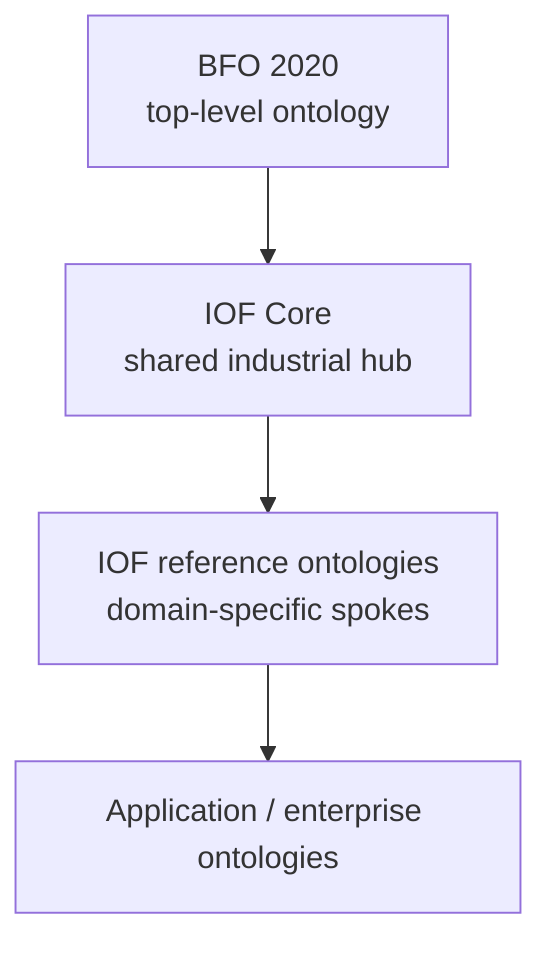
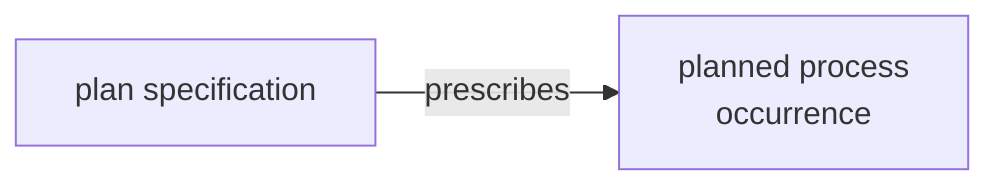
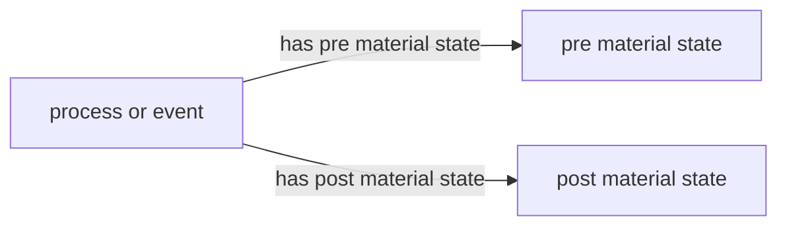
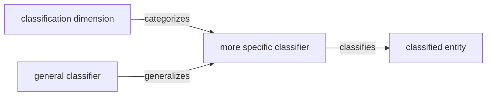
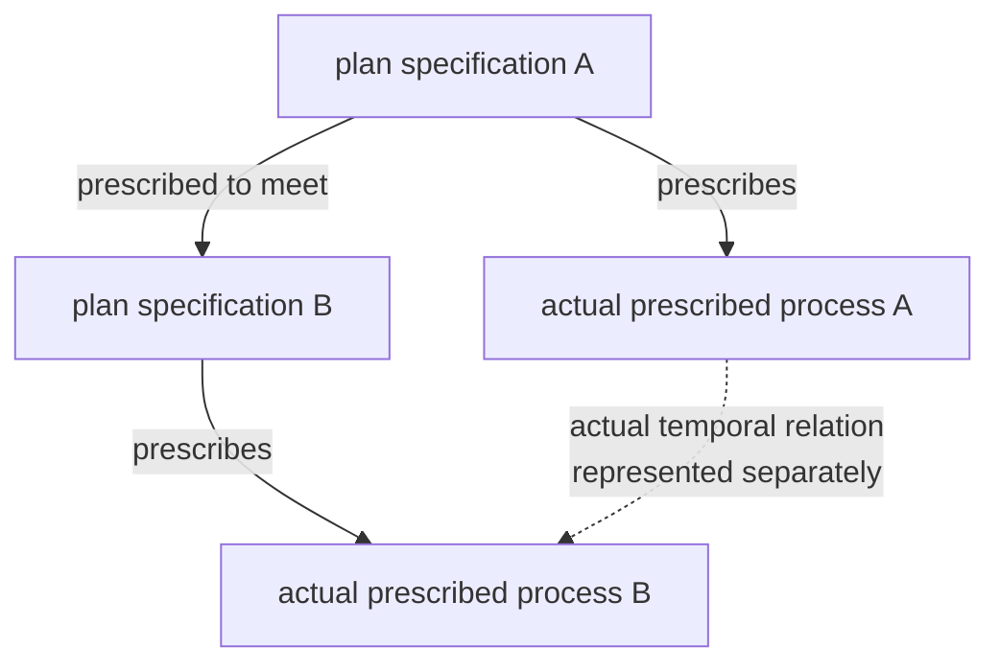

<p align="center">


</p>

# IOF Core Ontology

**Cross-industry semantics for industrial ontologies.**

The Industrial Ontology Foundry (IOF) Core Ontology is a mid-level industrial ontology and shared foundation for IOF ontologies. It extends BFO 2020 with reusable industrial concepts and relations that support semantic interoperability, industrial knowledge graphs, data integration, and grounded AI/LLM applications.

---

## Contents

- [Where Core fits](#where-core-fits)
- [What Core provides](#what-core-provides)
- [Using Core](#using-core)
- [Key modeling patterns](#key-modeling-patterns)
- [Formalization and Annotation Vocabulary](#formalization-and-annotation-vocabulary)
- [Interoperability mappings](#interoperability-mappings)
- [Repository, versioning, and maturity](#repository-versioning-and-maturity)
- [Contributing](#contributing)
- [License and resources](#license-and-resources)

---

## Where Core fits



IOF follows a tiered, hub-and-spoke architecture. BFO 2020 provides the domain-independent top-level foundation. Core extends that foundation with shared industrial semantics and serves as the common industrial hub for the IOF ontology suite. More specialized IOF reference ontologies build on Core for particular industrial domains, with application and enterprise ontologies providing narrower implementation-specific models.

Core is intentionally mid-level. It does not try to provide detailed manufacturing, supply-chain, maintenance, systems-engineering, or biopharmaceutical terminology. Those areas belong in specialized IOF ontologies.

Within this architecture, domain and application ontologies can use Core concepts directly, map to them, or extend them without forcing sector-specific detail into the common foundation.

Using a common Core foundation does not by itself make downstream ontologies or data models interoperable. It provides shared concepts and relations that reduce semantic ambiguity and support explicit mappings and cross-domain integration.

---

## What Core provides

The following are the main modeling areas in the current Core ontology.

| Area | Core distinction or pattern |
|---|---|
| **Requirements and designs** | requirement specifications and design specifications are kept distinct, with explicit relations for representing requirement satisfaction |
| **Plans and execution** | plan specifications and action/objective specifications are distinct from the planned process occurrences they prescribe |
| **Reusable industrial processes** | broad industrial process types provide common starting points for domain-level and sector-specific process taxonomies |
| **Materials and equipment** | context-dependent classifications such as raw material, product, consumable, resource, and piece of equipment are represented through roles |
| **Functions and capabilities** | what an entity is designed to do is kept distinct from broader capabilities it may possess |
| **Agents and organizations** | reusable agent, organization, buyer, supplier, manufacturer, customer, and service-provider patterns |
| **Values and measurement** | value expressions represent qualitative, semi-quantitative, or quantitative values of entities; measured values use a more specific pattern that distinguishes what is measured, the measurement process, measurement information, and the resulting measured value expression |
| **Process behavior** | a time-varying `process profile` is distinct from a whole-process `process characteristic` |
| **Material states and events** | material states, pre-states, post-states, and recognized events support explicit representation of persistent conditions and notable occurrences |
| **Process dynamics** | `causes`, `modulates`, and planned `controls` provide progressively more specific process-dynamics semantics |
| **Identification and classification** | denoters, identifiers, and classifiers are represented as different information artifacts with different uses |
| **Time and process relations** | relations support ordering, overlap, containment, synchronization, and shared boundaries among processes and time intervals |

---

## Using Core

### Browse online

The [IOF Ontology Browser](https://spec.industrialontologies.org/portal/) provides a zero-install way to inspect Core terms, definitions, annotations, hierarchy, and module context.

The browser may not immediately reflect unreleased repository changes. The RDF artifacts and their version and maturity metadata remain the source of truth.

### Using Core in applications

Core can be used directly where its level of abstraction is sufficient, or as the semantic foundation for reference and application ontologies. Existing data models, standards, and system schemas can be mapped to Core concepts without replacing the source representation. Core-aligned RDF can be queried with SPARQL and classified with OWL reasoning where the ontology provides the relevant axioms. Closed-world conformance requirements can be handled separately with SHACL or application rules.

Core uses standard RDF/OWL and does not prescribe a particular graph database, integration platform, enterprise schema, or AI technology.

### Choose the right entry point

| File | Use |
|---|---|
| [`Core.rdf`](./Core.rdf) | Direct import of Released IOF Core |
| [`AboutIOFProd.rdf`](./AboutIOFProd.rdf) | Default Released aggregate: BFO + Core + IOF Annotation Vocabulary |
| [`AboutIOFDev.rdf`](./AboutIOFDev.rdf) | Broader development/interoperability aggregate including OMG Commons mappings |
| [`catalog-v001.xml`](./catalog-v001.xml) | Local import resolution for ontology tooling |

Optional mappings and utilities are imported separately when needed.

### Developer quick start

```bash
git clone https://github.com/iofoundry/ontology.git
cd ontology/core
```

For the standard Released Core closure, open:

```text
AboutIOFProd.rdf
```

Core construct IRIs use the shared namespace:

```text
https://spec.industrialontologies.org/ontology/construct/
```

For example:

```text
https://spec.industrialontologies.org/ontology/construct/PlannedProcess
https://spec.industrialontologies.org/ontology/construct/PieceOfEquipment
https://spec.industrialontologies.org/ontology/construct/MeasurementProcess
```

A full IOF repository checkout is recommended for Protégé so the XML catalogs can resolve cached and sibling dependencies.

---

## Key modeling patterns

### Prescription and execution

One of the central Core distinctions is between what prescribes a process and the process that actually occurs.



Core defines a `planned process` simply as a process that is prescribed by a plan specification.

The important point is what *planned* means here. It does not mean “future” or “not yet executed.” A planned process may already have occurred. The term means that the process is protocol-, instruction-, command-, or software-driven, or some combination of these. The prescription also does not need to be an externalized or highly detailed planning document: as the Core explanatory note makes explicit, a protocol may be written, spoken, or simply thought. The modeling commitment is that the process is governed by a plan specification, not that every planned process has its own detailed document.

This gives downstream ontologies a consistent way to keep prescription and execution separate while still connecting what was intended or instructed to what actually happened.

### Reusable industrial processes

Beyond the plan/execution pattern, Core provides broad industrial processes that recur across domains. These classes act as common semantic anchors that reference and application ontologies can specialize, providing shared starting points for domain-level and sector-specific process taxonomies.

| Core process | What it provides |
|---|---|
| `manufacturing process` | general foundation for planned industrial transformation and production processes |
| `assembly process` | manufacturing-process specialization for assembly |
| `material location change process` | common foundation for planned movement of material entities between locations |
| `measurement process` | common foundation for measurement activities and their resulting measurement information |
| `computing process` | common foundation for planned computational activity |
| `business process` | planned activity with business objectives; supports specializations such as buying, supplying, procuring, offering for sale, product production, and commercial service |

`product production process` connects the business and manufacturing views by including manufacturing activity that creates a material product. Core also provides `commercial service specification` and `commercial service agreement` so prescribed services and agreements remain distinct from the service process itself.

**Value:** source systems often describe the same broad industrial activity using different local terms. These shared process types give data integration, industrial knowledge graphs, semantic search, reasoning, and AI systems stable concepts for connecting those records while leaving detailed workflows and sector-specific operations to downstream ontologies.

### Role-based industrial classifications

Core uses roles where an industrial classification depends on how an entity is used.

Examples include:

- `raw material`
- `material component`
- `material product`
- `consumable`
- `material resource`
- `piece of equipment`
- `maintainable material item`

For example, `piece of equipment` is a defined class based on an engineered system or material artifact bearing an `equipment role`. This avoids treating every context-dependent industrial use as an intrinsic type.

### Functions and capabilities

Core distinguishes designed function from broader capability. A `designed function` is a function prescribed by a design specification, while a `capability` represents an ability whose realization is of interest to an agent. Core also defines an `engineered system` as a system deliberately created to have a function.

Not every capability is a function: an engineered asset may be capable of behavior beyond the purpose for which it was designed.

**Value:** equipment, systems-engineering, digital-twin, and resource-matching models can represent designed purpose separately from available capability, supporting more precise knowledge-graph queries and AI reasoning about what an asset is intended to do versus what it can do.

### Values, measurement, and process behavior

Core provides a general `value expression` pattern for representing a value of an entity within a classification scheme or on a quantitative scale. Value expressions may be qualitative, semi-quantitative, or quantitative. They can represent, for example, a value specified in a design, a value obtained through measurement, a qualitative classification such as `low risk`, or a value generated by a simulation.

For measured values, Core adds a more specific measurement pattern:

thing or attribute measured → measurement process → measurement information → measured value expression

This keeps measurement-specific semantics distinct while allowing the general value-expression pattern to be used independently of measurement.

Core also distinguishes a process profile, which captures time-varying process behavior, from a process characteristic, which summarizes the process as a whole.

Examples:

- temperature over time → process profile
- maximum temperature → process characteristic
- RPM over time → process profile
- average RPM → process characteristic

### Material states and events

Core represents a material state as a process in which a material entity remains in a particular condition. It supports pre- and post-states, prescribed material states, condition expressions, and complex states composed from other states.

Core also represents an event as a process or process boundary that is recognized by an agent and typically recorded. This supports recognizable industrial occurrences such as machine failures or threshold crossings without treating every process as an event.



**Value:** the pattern separates a condition that persists from the process that changes that condition. Domain ontologies can therefore represent process transitions, required material conditions, and aggregate states such as equipment-ready or acceptable-storage states without treating the state itself as a state-changing event.

### Classifiers and classification

Core distinguishes identifying an entity from classifying it. A `classifier` is a denoter used to classify entities as instances of a common type, for example a product code, material-grade classifier, equipment-type classifier, or another governed classification scheme.

Core provides:

- `classifies` / `classified by`
- `categorizes` / `categorized by`
- `generalizes` / `specializes`



**Value:** externally governed codes, grades, and taxonomies can classify industrial entities without being turned into ontology classes. This keeps the ontology class hierarchy distinct from the classification schemes used by applications and industry systems.

### Allen interval algebra and prescribed temporal relations

#### Allen-style temporal relations in Core

Core provides relations inspired by Allen's interval algebra for representing temporal structure among processes and intervals:

- `before` / `after`
- `meets` / `met by`
- `occurs during`
- `occurs simultaneously with`
- `temporally starts` / `temporally started by`
- `temporally finishes` / `temporally finished by`
- `temporally overlaps` / `is temporally overlapped by`

**Value:** sequencing, overlap, containment, synchronization, and shared boundaries can be represented directly rather than reconstructed only from timestamps.

#### Prescribed Allen relations for plans

The Released optional [`PrescribedAllenIntervalAlgebraUtility.rdf`](./addenda/utility/PrescribedAllenIntervalAlgebraUtility.rdf) provides plan-level counterparts such as `prescribed to meet`, `prescribed to occur during`, and `prescribed to temporally overlap`.

These relations connect plan specifications and state how their prescribed processes are required to relate temporally for conformance to the plan. They do not assert the temporal relation that actually held during execution.



This is useful for recipes, procedures, schedules, maintenance plans, and other prescriptive models where required timing must remain distinct from observed execution.

### Non-normative temporal reasoning addenda

Two optional non-normative artifacts provide additional temporal inference:

- [`TemporalRelationChain.rdf`](./addenda/propertychain/TemporalRelationChain.rdf) contains OWL property chains for Allen compositions that resolve to a single temporal relation. Compositions whose result would be a disjunction are not encoded.
- [`TemporalRelationsInference.rdf`](./addenda/swrl/TemporalRelationsInference.rdf) contains SWRL rules for deriving temporal relations, including process relations from occupied intervals and interval relations from their boundary instants.

They are implementation aids and do not change the normative semantics of `Core.rdf`.

---

## Formalization and Annotation Vocabulary

### Definitions, formalization, and annotation policy

Core follows the IOF Annotation Property Guide V2.5 and uses the shared IOF Annotation Vocabulary (AV) in [`meta/AnnotationVocabulary.rdf`](./meta/AnnotationVocabulary.rdf). `Core.rdf` imports the AV directly, so ontologies that import Core already have these annotation properties available.

The IOF authoring baseline distinguishes documentation and formalization expected for ontology constructs from annotations that are added when they are relevant:

| Layer / annotation | IOF practice |
|---|---|
| **Label** | provides the preferred human-readable term for a class or property |
| **Natural-language definition** | states the intended meaning of a class or property |
| **Examples** | illustrate intended use and help test the boundary of a construct |
| **OWL axioms** | provide the machine-processable semantics used for classification, reasoning, and consistency checking |
| **First-order-logic (FOL) definition or axiom** | documents the intended formal meaning and can augment the OWL representation with commitments that OWL cannot capture directly |
| **Semi-formal natural-language definition or axiom** | provides a readable counterpart to the FOL formalization |
| **Primitive status and rationale** | document where a class remains primitive and why stronger formalization is not currently asserted |
| **Explanatory notes** *(as applicable)* | clarify distinctions, modeling rationale, or interpretation that does not belong in the definition itself |
| **Usage notes** *(as applicable)* | provide guidance on how a construct should or should not be used |
| **Counterexamples** *(as applicable)* | clarify important exclusions or commonly confused cases |
| **Synonyms, acronyms, and abbreviations** *(as applicable)* | record alternative terminology used by domain experts, standards, systems, or literature |
| **Source and provenance annotations** *(as applicable)* | record sources and conceptual or definitional reuse through annotations such as `adaptedFrom`, `directSource`, and `excerptedFrom` |
| **Maturity and migration annotations** *(as applicable)* | record maturity, replacement, deprecation, and migration information |

OWL and FOL are not alternative semantic models. The FOL statement is intended to be consistent with the OWL semantics and can make additional formal commitments where the intended meaning cannot be represented directly in OWL. The corresponding semi-formal annotation expresses that same formal meaning in a form that is easier to review. FOL annotations are documentation and are not executed by standard OWL reasoners.

For example:

```text
PlannedProcess(x) ↔ Process(x) ∧ ∃s(PlanSpecification(s) ∧ prescribes(s,x))
```

and:

```text
PieceOfEquipment(x) ↔
(MaterialArtifact(x) ∨ EngineeredSystem(x))
∧ ∃r(EquipmentRole(r) ∧ hasRole(x,r))
```

Core reuses or adapts concepts from established ontology, standards, and technical sources where appropriate, including BFO, IAO/OBI, CCO, ISO standards, VIM, Allen's interval algebra, INCOSE, OAGIS/APICS, FIBO, and OMG Commons.

`adaptedFrom` records conceptual or definitional provenance. It does not by itself assert equivalence or identity with the source construct.

The AV OWL file defines the annotation properties themselves; the IOF Annotation Property Guide specifies how IOF authors are expected to use them consistently when authoring and reviewing ontology content.

[IOF Annotation Property Guide V2.5](https://oagi.atlassian.net/wiki/spaces/IOF/pages/6750797825/IOF+Annotation+Property+Guide+V2.5)

---

## Interoperability mappings

The repository provides interoperability mappings separate from the Core ontology itself:

- [`MappingCommonsToIOF.rdf`](./commonstocoremapping/MappingCommonsToIOF.rdf) — maps selected OMG Commons information and structural constructs into IOF/BFO. It includes formal alignment of `Identifier`, `denotes` / `denoted by`, identifier/designation relations, selected information-content constructs, and selected parthood/member relations.
- [`MappingAnnotationVocabularyToCommons.rdf`](./commonstocoremapping/meta/MappingAnnotationVocabularyToCommons.rdf) — maps IOF annotation properties to their OMG Commons Annotation Vocabulary counterparts, including abbreviation, acronym, provenance, explanatory-note, logical-definition, symbol, synonym, and usage-note properties.
- [`MappingTimeToIOF.rdf`](./owltimetocoremapping/MappingTimeToIOF.rdf) — connects Core temporal value-expression concepts to W3C OWL-Time, including temporal duration and temporal-position modeling, so applications can attach calendar/clock positions and duration values using OWL-Time reference systems and units.

These mappings provide interoperability bridges; they do not replace the native IOF Core constructs or make the external ontology libraries part of the default Released Core import closure.

---

## Repository, versioning, and maturity

### Repository contents

```text
core/
├── Core.rdf
├── AboutIOFProd.rdf
├── AboutIOFDev.rdf
├── catalog-v001.xml
├── meta/
│   └── AnnotationVocabulary.rdf
├── commonstocoremapping/
├── owltimetocoremapping/
└── addenda/
    ├── utility/
    ├── propertychain/
    └── swrl/
```

`Core.rdf` is the normative Released Core ontology. `AnnotationVocabulary.rdf` supplies the shared IOF documentation and governance annotations. The prescribed Allen utility is a separate Released optional module; the temporal property-chain and SWRL files are non-normative reasoning addenda; external mappings are separate interoperability artifacts.

### Versioning and maturity

Core terms use stable construct IRIs such as:

```text
https://spec.industrialontologies.org/ontology/construct/PlannedProcess
```

The supplied Core ontology uses the version IRI:

```text
https://spec.industrialontologies.org/ontology/202603/core/Core/
```

IOF version identifiers use `YYYYXX`, where `YYYY` is the year and `XX` is the release number within that year.

The supplied `Core.rdf` is Released. `AboutIOFDev.rdf` is a Provisional convenience aggregate; its maturity does not change the maturity of the Released artifacts it imports.

Applications should treat an IOF release update as a governed dependency update and rerun relevant mappings, reasoning, validation, and competency queries.

---

## Contributing

Core is developed through the IOF Core Working Group.

Public issues and change requests can be submitted through the:

[IOF ontology GitHub issue tracker](https://github.com/iofoundry/ontology/issues)

Include the affected construct IRI, release version, use case, and proposed change where possible.

---

## License and resources

### License

IOF Core is released under the MIT License.

### Citation

For the published description of IOF Core's architecture and development, cite:

Drobnjakovic, M., Kulvatunyou, B., Ameri, F., Will, C., Smith, B., & Jones, A. (2022). [The Industrial Ontologies Foundry (IOF) Core Ontology](https://scholar.google.com/citations?view_op=view_citation&hl=en&user=tm2A-yoAAAAJ&citation_for_view=tm2A-yoAAAAJ:YsMSGLbcyi4C). *CEUR Workshop Proceedings*, 3240.

### Resources

- [IOF Ontology Browser](https://spec.industrialontologies.org/portal/)
- [Industrial Ontology Foundry](https://oagi.org/pages/industrial-ontologies)
- [Released IOF Ontologies](https://oagi.org/pages/Released-Ontologies)
- [IOF ontology repository](https://github.com/iofoundry/ontology)
- [Basic Formal Ontology](https://basic-formal-ontology.org/)
- [OMG Commons Ontology Library](https://www.omg.org/spec/Commons/)
- [W3C OWL-Time](https://www.w3.org/TR/owl-time/)
- [IOF Guideline for Using QUDT with IOF Ontologies](https://oagi.atlassian.net/wiki/spaces/IOF/pages/4679696397/Guideline+for+Using+QUDT+if+were+to+use+with+IOF+Ontologies) — non-normative guidance for representing quantitative values and units

