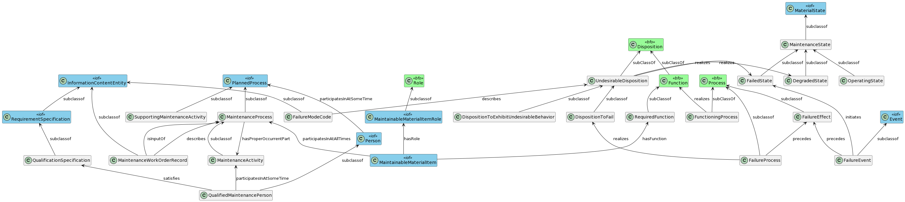

# The Maintenance Reference Ontology

## About the Maintenance Reference Ontology

The Maintenance Reference Ontology supports modelling of concepts associated with asset reliability and maintenance management. It is relevant for data captured at the design stage of the asset life cycle (e.g. in failure modes and effects analysis) and in the operations and maintenance phase of the life cycle (e.g. asset reliability and the maintenance activities associated with delivering value from use of the assets).

This Maintenance Reference Ontology is a minimal ontology aligned to IOF CORE and by extension BFO. It deliberately captures only concepts frequently captured in data in the maintenance phase of the asset life cycle.

This minimal ontology supports the use of modular ontologies for specific classes of interest and application ontologies (examples below). Proposed modular ontologies include asset functions, FMEA codes, maintenance activities. Each of these can be attached to this Reference Ontology.

This Maintenance Reference Ontology includes the following classes and object properties. Each defined class has natural language, first order logic and a semi-formal definition. Each primitive has a natural language definition and necessary or sufficient axioms as appropriate.

### Glossary of terms

A glossary of entities and relations in this ontology is at https://uwasystemhealth.github.io/IOF-MRO-Glossary/

## Organisation of the folder

The ontology is in the file 'Maintenance.rdf'.

Some application ontologies may wish to import the cco and/or relations ontologies and copies of these are provided in the imports folder.

Users of plantuml can create a figure of the classes using the text file in the plant uml folder.

Images produced to illustrate the reference ontology are in the images folder.

## Contributing to this ontology

The authors welcome discussion on the future of this Reference Ontology. Contributors are requested to post an issue in this GitHub folder and use the label 'maintenance'.

## Application Ontologies that make use of this Reference Ontology or specific formalisms in this ontology

Application Ontologies aligned to classes in this Reference Maintenance Ontology are described in a number of papers and GIT sites. A list is below.

Woods C, Selway M, Bikaun T, Stumptner M, Hodkiewicz M., 2022. An ontology for maintenance activities and its application to data quality. In review for Semantic Web Journal

Woods, C., French, T., Hodkiewicz, M. and Bikaun, T., 2023. An ontology for maintenance procedure documentation. Applied Ontology, pp.1-38. https://content.iospress.com/articles/applied-ontology/ao230279

Woods, C., Selway, M., Bikaun, T., Stumptner, M. and Hodkiewicz, M., 2023. An ontology for maintenance activities and its application to data quality. Semantic Web Journal, pp.1-34. https://content.iospress.com/articles/semantic-web/sw233299

Woods, C., Selway, M., Hodkiewicz, M., Ameri, F., Stumptner, M. and Sobel, W., 2021. On the Notion of Maintenance State for Industrial Assets. FOMI 2021: 11th International Workshop on Formal Ontologies meet Industry, held at JOWO 2021: Episode VII The Bolzano Summer of Knowledge, September 11–18, 2021, Bolzano, Italy. http://ceur-ws.org/Vol-2969/paper22-FOMI.pdf

Hodkiewicz, M., Klüwer, J.W., Woods, C., Smoker, T. and Low, E., 2021. An ontology for reasoning over engineering textual data stored in FMEA spreadsheet tables. Computers in Industry, 131. An ontology for reasoning over engineering textual data stored in FMEA spreadsheet tables. https://www.sciencedirect.com/science/article/pii/S0166361521001032

Hodkiewicz, M., Low, E., Woods, C. and Ameri, F, 2020. Towards a Reference Ontology for Maintenance Work Management. Proceedings of the Workshops of I-ESA 2020, 17-11-20, Tarbes, France. http://ceur-ws.org/Vol-2900/WS5Paper2.pdf

Karray, M.H., Ameri, F., Hodkiewicz, M. and Louge, T., 2019. ROMAIN: Towards a BFO compliant reference ontology for industrial maintenance. Applied Ontology, 14(2), pp.155-177. https://content.iospress.com/articles/applied-ontology/ao190208

Lupp, D.P., Hodkiewicz, M. and Skjæveland, M.G., 2020. Template libraries for industrial asset maintenance: A methodology for scalable and maintainable ontologies. In CEUR Workshop Proceedings (Vol. 2757, pp. 49-64). Technical University of Aachen. Template Libraries for Industrial Asset Maintenance: A Methodology for Scalable and Maintainable Ontologies. https://www.duo.uio.no/bitstream/handle/10852/85254/SSWS2020_paper4%25286%2529.pdf

## Development of the Maintenance Reference Ontology

The final version of this Maintenance Reference Ontology was compiled by Caitlin Woods and Prof. Melinda Hodkiewicz at the University of Western Australia and Dr. Matt Selway and Prof. Markus Stumptner at the University of South Australia. Other active participants in the process were Will Sobel, Chris Will and Professor Farhad Ameri, all based in the USA. This ontology is managed by the IOF Maintenance Working Group.

## Current Outstanding Issues

Please refer to the list kept on the IOF Confluence site for potential improvements/ additions for a v2 and the Issues list here on GitHub.
