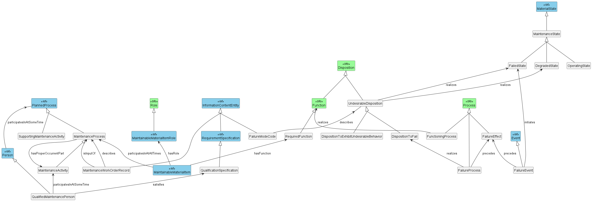

Issue: https://github.com/iofoundry/ontology/issues/85

I've made 4 variants of the `MaintenanceDevRelationships` diagram from source in `plantuml/`.
Pick the one you like best for use in the ontology description.

## MaintenanceDevRelationships
The original diagram, with some rationalizations:
- removed label "subClassOf" because that's 
- removed `(C)` circles (stereotypes)
- made all arrows go up since I didn't see any benefit to the layout in the original

## MaintenanceDevRelationships-LTR
Same but using "left to right direction" layout.

## MaintenanceDevRelationships-full

Added classes that were commented out in the original diagram. I think these are tentative and may be missing from the ontology.

## MaintenanceDevRelationships-full-LTR
Same but using "left to right direction" layout.

