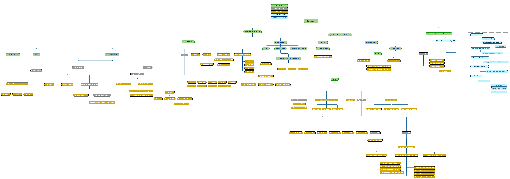

# Supply Chain Ontology
Supply Chain Reference Ontology (SCRO) aims to represent the generic constructs (including classes and properties) related to the domain of supply chain and logistics. SCRO uses BFO as the top-level ontology and IOF Core as the mid-level ontology. The purpose of the ontology is to serve as a foundation for ensuring consistency and interoperability across various supply chain and logistics ontologies that use IOF reference ontolgies. The Supply Chain reference ontology can be extended to create application ontologies addressing the needs of specific use cases. is Developmen of SCRO was initially motivated by use cases related to supplier discovery (i.e., supplier capability matching with manufacturing requirements), logistics,  and supply chain traceability.
 

SCRO.owl imports BFO-2020.owl, IOF.owl and IOF-AnnotationVocabulary.rdf (Imports folder). 

To open the Supply Chain ontology, perform the following steps:

1. Download SupplyChainReferenceOntology.rdf file
2. Download import folder 
3. Open SupplyChainReferenceOntology.rdf with "Protege".
4. Protege might prompt you to manually find some files that the ontology imports. All relevant files can be found in the "Imports" folder.
5. You need to import Core.rdf and AnnotationVocabulary.rdf
6. BFO 2020 is imported through Core.rdf so you don't need to import it directly 

SCRO is currenlty in draft status and it is not officially released yet.

## Version history

### Current development (2022-11-08):

Added 
- Classes and object properties for initial release
- All required annotations; optional annotations where appropriate

## Current Outstanding Issues
