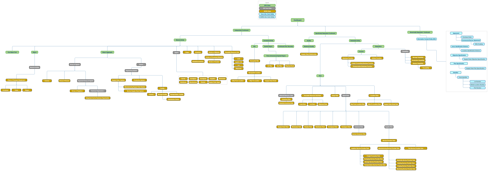

# Supply Chain Reference Ontology (SCRO)

Version 1 Beta, 2022-11-18

*The IOF is an international standards group that operates under the auspices of the Open Applications Group.*

# Introduction

The Supply Chain Ontology aims to represent generic constructs, including classes and properties, related to the domains of supply chain and logistics. The ontology uses BFO as its top-level ontology and IOF Core as its mid-level ontology. Its purpose is to provide a common semantic foundation for ensuring consistency and interoperability across supply chain and logistics ontologies developed for different domains and applications.

The Supply Chain Ontology can be extended to create application ontologies that address the requirements of specific use cases. Its development was initially motivated by use cases related to supplier discovery (i.e., matching supplier capabilities with manufacturing requirements), shipment request and fulfillment, and agri-food supply chain traceability. While the development of the ontology is driven by specific use cases, its terms and definitions are intended to be broadly applicable beyond these use cases. Whenever possible, terminology and definitions are derived from widely accepted industry standards to promote consistency, reuse, and interoperability across supply chain applications.

### Taxonomy of SCRO Continuants
> click the image to view the enlarged image in a new tab

### Taxonomy of SCRO Occurrents
> click the image to view the enlarged image in a new tab

## Glossary of Terms
[The glossary](https://htmlpreview.github.io/?https://github.com/InfoneerTXST/Glossary/blob/master/index.html) provides the natural language definitions of SCRO classes and properties

## Example RDF Dataset
This dataset represents a hypothetical supply chain as depicted in [this image](https://github.com/iofoundry/ontology/blob/master/supplychain/Documentation%20&%20Resources/Terms-Patterns-Modules/Ford%20Supply%20Chain.md). The RDF dataset demonstrates how the class "Supply Chain Relationship' is used to represent the strucrue of a supply chain.
- [RDF Dataset](https://github.com/iofoundry/ontology/blob/master/supplychain/data/SCRO_Ford.tt)
=======
Additional class diagrams can be found [here](https://oagiscore.atlassian.net/wiki/spaces/IOF/pages/4554031140/SCRO+Class+Diagrams). 

## Example Data in RDF
This dataset represents a hypothetical supply chain as depicted in [this image](https://github.com/iofoundry/ontology/blob/SCRO-pre-vote-branch/supplychain/Documentation%20%26%20Resources/images/FORD-SupplyChain.png). The RDF dataset demonstrates how the class "Supply Chain Relationship' is used to represent the strucrue of a supply chain.
- [RDF Dataset](https://github.com/iofoundry/ontology/tree/SCRO-pre-vote-branch/supplychain/data)

## Related Publications
- Farhad Ameri, Evan Wallace, Reid Yoder, Frank Riddick (2022) Enabling Traceability in Agri-Food Supply Chains Using an Ontological Approach, ASME Journal of Computing and Information Systems in Engineering (JCISE), October 2022; 22(5): 051002. https://doi.org/10.1115/1.4054092
- Ameri, F., Sormaz, D., Psarommatis, F., & Kiritsis, D. (2021). Industrial ontologies for interoperability in agile and resilient manufacturing. International Journal of Production Research, 1-22. https://doi.org/10.1080/00207543.2021.1987553
- Farhad Ameri, Evan Wallace, Boonserm Kulvatanyou, and Chris Will, Towards a Reference Ontology for Supply Chain Management, Proceedings of International Conference on Interoperability for Enterprise Systems and Applications (I-ESA), IOF Workshop, November 2020, France, Tarbes.
- Farhad Ameri, Evan Wallace, Reid Yoder, Enabling Traceability in Agri-Food Supply Chains Using an Ontological Approach, ASME International Design Engineering Technical Conferences and Computers and Information in Engineering Conference,  ASME IDETC2020-19995, August 2020, St. Louis, MO.
- Farhad Ameri and Boonserm Kulvatanyou, Modeling a Supply Chain Ontology Based on a Top-Level Ontology, International Design Engineering Technical Conferences and Computers and Information in Engineering Conference, Volume 1B: 38th Computers and Information in Engineering Conference, ASME IDETC2019-98278, Anaheim, CA,  August 2019.
